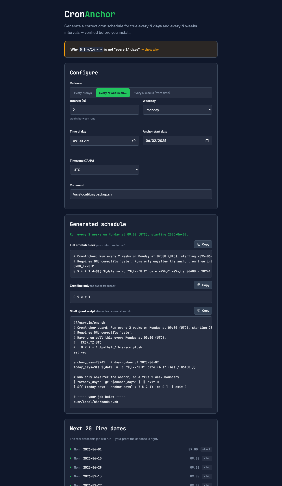

# CronAnchor

**Generate a correct cron schedule for true `every N days` and `every N weeks`
intervals — the ones plain cron genuinely can't express — and see the next 20 real fire
dates before you install.**

[](./LICENSE)
[](#development)
&nbsp;**[▶ Live demo](https://skytuhua.github.io/cronanchor/)**


---

## The problem

`0 0 */14 * *` does **not** mean "every 14 days."

Cron evaluates `*/14` inside the **day-of-month** field (range 1–31), so it fires on
days **1, 15, 29 — and then resets at the month boundary**. The gap from the 29th to the
next 1st is only 2–3 days, not 14. Standard cron has no native syntax for true intervals
that don't evenly divide a month or a week (every 2 weeks, every 14 days, every 3 weeks).

The only real workaround is a hand-written shell guard with epoch/modulo math that you
have to edit yourself and **can't verify** until it misfires in production weeks later.
Even popular cron generators get this wrong and ship the broken `*/14` expression with no
warning.

## What CronAnchor does

You pick a cadence, an **anchor start date**, and an **IANA timezone**. CronAnchor
instantly gives you:

1. **A gating cron line** — fires at the candidate frequency (daily, or weekly on a
   weekday).
2. **A correct, copy-pasteable shell guard** — lets the job run *only* on true interval
   boundaries, anchored to your start date, **DST-safe**, ready to paste into
   `crontab -e` (or saved as a standalone `.sh`).
3. **A live preview of the next 20 real fire dates** in your timezone — your proof the
   schedule is right *before* you install it.

- 🔒 **100% client-side** — nothing you type leaves your browser; no network calls, no
  tracking, no accounts. Safe to use with production schedules.
- 🧮 **Correct by construction** — DST-, leap-year-, and month-boundary-safe day math,
  with **zero runtime dependencies**. The in-app preview and the generated guard derive
  their dates the same way, so they always agree.
- 📋 One-click copy, shareable URLs, keyboard-accessible, responsive.

## How it works

The trick is to measure whole **calendar days** from your anchor and gate on them:

```sh
# every 14 days from 2025-01-01, at 09:00 UTC — paste into `crontab -e`
CRON_TZ=UTC
0 9 * * * d=$(( $(date -u -d "$(TZ='UTC' date +\%F)" +\%s) / 86400 - 20089 )); [ "$d" -ge 0 ] && [ $(( d \% 14 )) -eq 0 ] && /usr/local/bin/backup.sh
```

Cron fires daily; the guard computes today's day-number (the calendar date reinterpreted
at **UTC midnight**, so the arithmetic is immune to DST and to the server's own
timezone), subtracts the baked-in anchor day-number, and runs the job only when the
difference is `≥ 0` (on/after the anchor) **and** an exact multiple of the interval.
This deliberately avoids the fragile `date +%s / 604800 % 2` epoch-week-parity trick,
which drifts across DST and depends on the locale week start.

## Usage

1. Open the **[live demo](https://skytuhua.github.io/cronanchor/)** (or run it locally,
   below).
2. Choose a **cadence**:
   - **Every N days** — e.g. every 14 days.
   - **Every N weeks on a weekday** — e.g. every 2 weeks on Monday.
   - **Every N weeks from a date** — the weekday is taken from your anchor date.
3. Set the **interval**, **time of day**, **anchor start date**, and **timezone**.
4. Read the **next 20 fire dates** to confirm the cadence is what you intended.
5. Click **Copy** on the *Full crontab block* and paste it into `crontab -e`.

The full app configuration is encoded in the URL, so any schedule is shareable and
bookmarkable.



## Run / build locally

Requires Node.js 20+.

```sh
git clone https://github.com/Skytuhua/cronanchor.git
cd cronanchor
npm install
npm run dev      # start the dev server (http://localhost:5173)
npm run build    # produce a static bundle in dist/
npm run preview  # serve the production build locally
```

The build in `dist/` is a fully static site — host it anywhere (GitHub Pages, Netlify,
an S3 bucket, or just open it from a file server).

## Limitations

- The generated guard targets **GNU coreutils `date`** (standard on Linux). BSD/macOS
  and busybox `date` parse `-d`/`-u` differently — per-platform variants are planned.
- v1 deliberately does **not** do: systemd-timer (`OnCalendar`) output, multi-job crontab
  management, or natural-language input ("every other Tuesday"). It is a focused tool for
  the one thing plain cron can't do; for ordinary divisible schedules, use
  [crontab.guru](https://crontab.guru).

## Development

```sh
npm test            # run the Vitest suite (63 tests)
npm run coverage    # tests with coverage
npm run typecheck   # tsc --noEmit (strict)
npm run lint        # eslint
npm run format      # prettier --write
```

The pure, dependency-free date engine lives in `src/core/` and carries the bulk of the
tests (DST transitions, leap years, month boundaries, past/future anchors, exact
guard-string output). See [`ARCHITECTURE.md`](./ARCHITECTURE.md) for the design and
[`SPEC.md`](./SPEC.md) for the v1 feature contract.

## License

[MIT](./LICENSE) © Skytuhua
